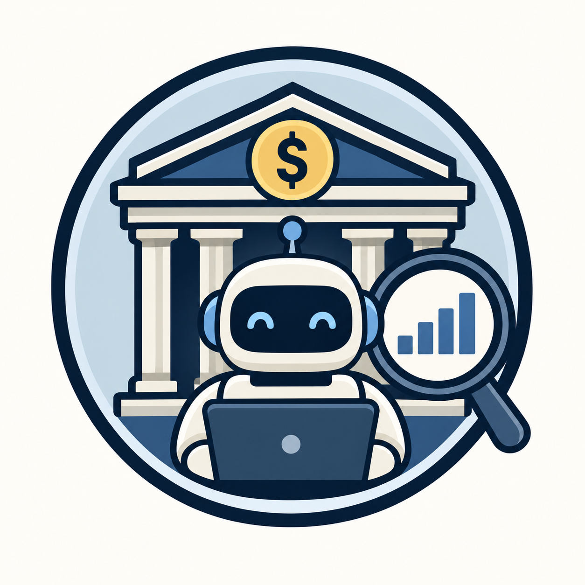

<p align="center">
  
</p>

# Ameria Tariff Monitor

An evidence-backed Google ADK prototype for monitoring Ameria Bank consumer-loan
and mortgage tariffs. Gemini handles intent resolution, bounded cache-aware source
classification, native PDF structure transcription, and evidence-bound extraction;
security controls, ingestion, validation, persistence, comparison, scheduling, and
HITL routing are deterministic.

The repository contains deterministic acquisition, structural normalization,
cache-aware source discovery, secure PDF retrieval, bounded Gemini PDF extraction and
semantic extraction, dual source/summary knowledge projections, a transactional
PostgreSQL/pgvector store, hybrid retrieval, durable monitoring runs and snapshots,
change detection, and human-in-the-loop review. Ordinary tariff questions are
answered from accepted typed facts with per-value citations; the older chunk-RAG
answer path remains available behind `TARIFF_ANSWER_READ_MODEL=legacy`. Claim
generation and semantic claim verification are intentionally deferred.

## Runtime

- ADK agent and standard ADK/A2A FastAPI surface
- Project API under `/api/v1`
- Daily worker at 06:00 `Asia/Yerevan`
- PostgreSQL 17 with pgvector
- Docker Compose for a single AWS compute instance

## Documentation

[`docs/README.md`](docs/README.md) indexes everything. Start with:

- [agent and tool architecture](docs/agent-and-tool-architecture.md) — what the agent
  is, which tools it has, and the major design decisions;
- [architecture diagram](docs/architecture-diagram.md) — components, the pipeline,
  the human-review pause, and the read path;
- [architecture](docs/architecture.md) — the boundary-by-boundary reference;
- [configuration](docs/configuration.md) — every environment variable.

Per-stage designs live in [acquisition](docs/acquisition.md),
[normalization](docs/normalization.md), [source discovery](docs/source-discovery.md),
[semantic extraction](docs/semantic-extraction.md),
[knowledge store](docs/knowledge-store.md), [indexing projections](docs/indexing-projection.md),
[snapshot lifecycle](docs/snapshot-lifecycle.md), and [seed catalog](docs/seed-catalog.md).
Operating it is covered by [run lifecycle](docs/run-lifecycle.md),
[native ADK review](docs/native-hitl-review.md), [failure behavior](docs/failure-behavior.md),
[observability](docs/observability.md), and [demonstrations](docs/demonstrations.md).
The generated ADK integration surface is described in
[.agents-cli-spec.md](.agents-cli-spec.md).

## Local setup

1. Copy `.env.example` to `.env` and set `GEMINI_API_KEY`.
2. Install dependencies: `agents-cli install`.
3. Install the local acquisition browser: `uv run playwright install chromium`.
4. Verify/create the ADK session schema: `uv run python scripts/check_adk_session_schema.py`.
5. Run deterministic tests: `uv run pytest tests/unit`.
6. Start the full stack: `docker compose up --build`.
7. Open API documentation at `http://localhost:8080/docs`.

For a durable terminal conversation, run `./tariff-chat` after the Compose
stack is up. It shows monitoring stages while the worker runs and prints a
session ID. Reconnect with `./tariff-chat --session-id <id>`.

The ADK playground can be started with `agents-cli playground` after dependencies are
installed. Behavioral evaluation uses `agents-cli eval run`; it requires configured
model credentials and an indexed local corpus.

## Local logs

`docker compose logs -f --tail=200 worker api` shows live console output. Compose also
writes rotating, persistent host files under `logs/api.log` and `logs/worker.log`;
numbered files such as `worker.log.1` hold older entries across container recreation.
Use `rg '<run-id>' logs/` to inspect a past run. Each file entry has an ISO 8601 timestamp
with an explicit offset, defaulting to `Asia/Yerevan`. `LOG_TIMEZONE`, `LOG_LEVEL`,
`LOG_MAX_BYTES`, and `LOG_BACKUP_COUNT` are configurable in `.env`. Logs stay on the EC2
host disk and must be copied or shipped separately to survive host replacement.

## Tracing and metrics

Tracing is off by default. Set `OTEL_ENABLED=true` to print spans to the console,
which is enough to see a whole run end to end. For a UI, start the opt-in profile
with `docker compose --profile observability up -d` and point `OTEL_TRACES_ENDPOINT`
at Langfuse on `http://localhost:3001`.

One monitoring run is one trace even though it crosses processes: the trigger, the
worker that claims it, and the process that resolves a human review all contribute
spans. Prompts and model responses are kept out of exported spans unless
`OTEL_TRACE_CONTENT=mapped` is set explicitly.

`uv run python scripts/run_metrics_report.py --days 30` reports run duration,
failure taxonomies, per-field extraction completeness, evidence coverage, and HITL
rate from the audit tables. See [observability](docs/observability.md).

## Main layout

```text
app/agent.py          ADK root agent
app/tools.py          constrained agent tool adapters
app/api/              user-trigger and HITL HTTP contracts
app/domain/           tariff/evidence schemas and pure rules
app/services/         application orchestration contracts
app/repositories/     persistence contracts
app/security/         network and content trust boundaries
app/worker.py         scheduled trigger
migrations/           PostgreSQL/pgvector schema
tests/unit/           deterministic tests
tests/eval/           agent/RAG evaluation scaffold
```

## Security notes

Only exact configured HTTPS hosts are accepted. Redirect targets must be checked with
the same validator when retrieval is implemented. The model is not given filesystem,
shell, arbitrary network, or SQL access. Production deployments should inject secrets
through AWS Secrets Manager and put authenticated HTTPS ingress in front of FastAPI.

## AI-assisted development disclosure

OpenAI Codex and Google Agents CLI were used to refine the architecture, generate the
canonical ADK scaffold, and establish implementation and test boundaries. The project
owner remains responsible for reviewing, understanding, testing, and presenting all code.
