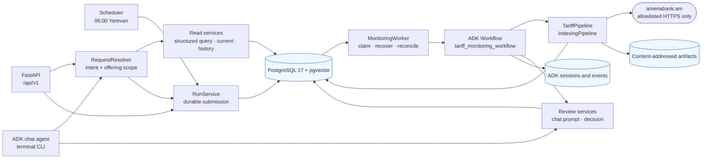
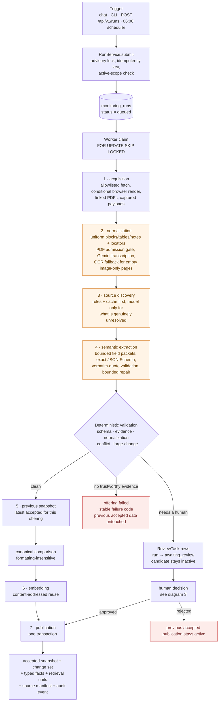
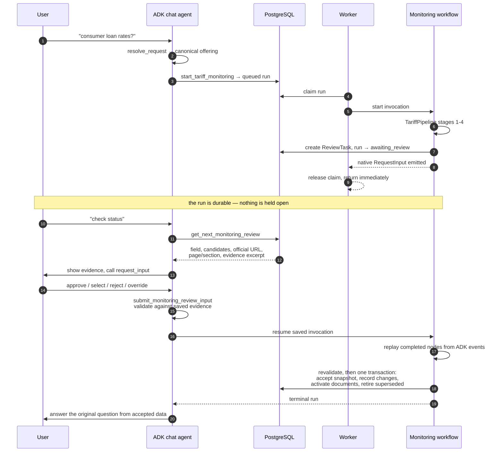
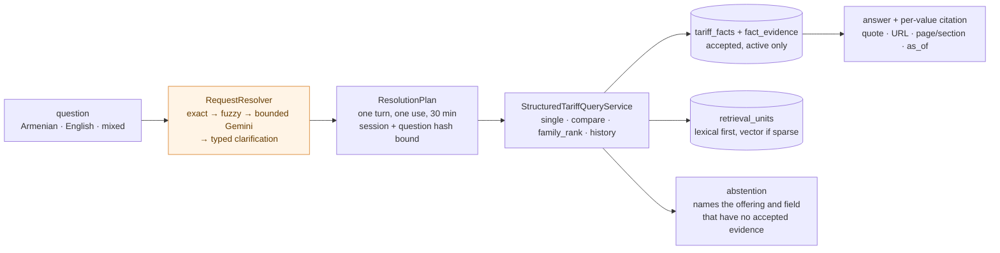

# Architecture diagram

Deliverable 3 of `Project Documents/System Description.md`. Five views of the same
system: components, one monitoring run, the human-review pause, the read path, and
the trust boundary. Prose for each boundary is in [architecture.md](architecture.md);
the reasoning is in
[agent-and-tool-architecture.md](agent-and-tool-architecture.md).

The first four views are Mermaid diagrams and render in GitHub and VS Code; the
fifth is a set of tables, because it enumerates rather than connects. A plain-text
summary of the main flow is at the end for terminal viewing.

---

## 1. Components

Three processes — FastAPI, the worker, and the terminal CLI — share one
composition root (`app/runtime.py`), one PostgreSQL database, and one ADK session
store. Only the pipeline touches the bank.



State ownership is deliberately split between the two stores. PostgreSQL owns
runs, snapshots, changes, reviews, typed facts, chunks, and audit events. ADK owns
workflow node progress, invocation and interrupt identity, and the native function
response. Correlation IDs link them; neither store infers a decision belonging to
the other.

### Where Gemini is called

Five call sites, all made by an application service, all schema-bound, none
holding a tool:

| Call site | Model setting | What it decides | What validates the response |
|---|---|---|---|
| `AdkIntentClassifier` | `MODEL_NAME` | intent and offering, only when exact and fuzzy matching were insufficient | output restricted to the supplied enum values and candidate IDs |
| `GeminiPdfExtractionService` | `PDF_EXTRACTION_MODEL_NAME` | transcribing an admitted PDF into blocks, tables, and notes | every page present exactly once, rectangular tables, strict schema |
| `TesseractOcrTranscriber` | none — local engine, no model | reading a rendered page image when the probe says `image_only` and Gemini returned nothing | deterministic trigger, page/pixel/timeout bounds, confidence floor, OCR-marked provenance |
| `AdkSourceDiscoveryClassifier` | `SOURCE_DISCOVERY_MODEL_NAME` | whether an unresolved unit belongs to this product | exactly one known source ID per requested item |
| `AdkSemanticExtractor` | `MODEL_NAME` | evidence into typed tariff field values | in-batch evidence IDs, verbatim quotes, Pydantic contracts |
| `GeminiEmbeddingProvider` | `EMBEDDING_MODEL_NAME` | nothing — vectors only | count, 768 dimensions, finite values |

The root chat agent itself is a sixth site: it chooses which tool to call, and
every tool re-checks its own authorization rather than trusting that choice. The
legacy `GeminiAnswerGenerator` is a seventh, reachable only under
`TARIFF_ANSWER_READ_MODEL=legacy`.

The four schema-bound stages run with thinking disabled, since reasoning tokens
were being billed at the output rate for output whose shape is already fixed. The
user-facing answer generator keeps thinking on, because reasoning over retrieved
evidence is the product there.

---

## 2. One monitoring run

This is the flow section 4 of the assignment asks for, as it is actually
implemented. `IndexingPipeline.refresh()` runs the seven numbered stages for one
offering; `TariffPipeline` runs one such sequence per offering in the family and
isolates their failures from each other.



Orange stages are the ones that call Gemini. Stages 1, 5, 6, and 7 and every
decision diamond are pure Python.

Two properties are worth reading off the diagram. First, no path reaches "accepted
snapshot" without passing the validation diamond. Second, both failure exits lead
to the previous accepted data staying exactly where it was — a failed or rejected
run degrades freshness, never correctness.

---

## 3. Human review, across processes

A run is submitted in one process, executed in another, and resolved in a third.
ADK owns the paused invocation; PostgreSQL owns the business decision. Neither
store infers the other's state.



Resumption replays completed pipeline nodes from ADK events rather than re-running
them, so acquisition and extraction execute exactly once no matter how long the
reviewer takes. API-triggered and scheduled runs follow the same sequence with ADK
Web in place of the chat agent; `POST /api/v1/reviews/abort-pending` is the
token-protected bulk `reject_all`.

---

## 4. Answering a question

Questions never acquire sources. They read what monitoring already accepted.



The plan is an authorization, not routing metadata: a plan that is absent,
replayed, expired, cross-session, or widened is rejected before any repository
call. Comparisons and rankings are computed in Python from typed facts — Gemini
never does the arithmetic, and a ranking abstains rather than comparing values that
differ in currency, unit, rate basis, or fee scope.

`TARIFF_ANSWER_READ_MODEL=legacy` swaps the fact reads for the older
chunk-retrieval path within the same authorized scope.

---

## 5. Trust boundary

The same constraint from every angle. A diagram would only restate three lists, so
here they are as lists.

**What a Gemini call receives**

| Input | Bound |
|---|---|
| The user's request | the text of one turn, nothing accumulated |
| Allowed answers | the exact enum values and catalog candidate IDs for that decision |
| Evidence | a bounded packet of selected passages, each with an immutable evidence ID |
| Output contract | the exact Pydantic-derived JSON Schema of each requested field |
| Document bytes | the original PDF of one admitted document |

**What it never receives**

| Capability | Why it is absent |
|---|---|
| Network, browser, or fetch tool | acquisition is an application service behind a host allowlist |
| Filesystem or shell tool | artifact paths are derived from SHA-256 only, never from model or source strings |
| Database handle, SQL, or repository | every read is a typed service call with the scope already fixed |
| Authority to widen its own scope | the `ResolutionPlan` is issued before the call and consumed once |
| Authority to accept anything | acceptance, activation, and publication are deterministic transactions |

**What Python checks on the way back**

| Check | Failure behavior |
|---|---|
| Enum and candidate membership | falls back to typed clarification, never to a guess |
| Evidence IDs known to that batch | the field becomes a review item |
| Citation quotes occurring verbatim in the cited evidence | the field becomes a review item |
| Pydantic domain contracts | one bounded repair, then review |
| URL, page, and section | restored server-side from the retrieved hit, never trusted from output |

Source text that reaches the model is labelled untrusted data in every prompt, and
a model response can only ever become a *proposal*. The deterministic services
decide what is persisted, activated, and published.

---

## Plain-text summary

For terminals without Mermaid rendering:

```text
  chat / CLI / POST /api/v1/runs / 06:00 scheduler
                    |
                    v
      RunService  ->  PostgreSQL durable queue
                    |
                    v
      worker claim (FOR UPDATE SKIP LOCKED)
                    |
                    v
      resumable ADK monitoring workflow
                    |
                    v
  +--------------- TariffPipeline, per offering ----------------+
  |                                                             |
  |  1 acquisition       allowlist, render, linked PDFs         |
  |  2 normalization     uniform evidence   [PDF -> Gemini,    |
|                                          scanned -> OCR]   |
  |  3 source discovery  rules + cache first   [rest -> Gemini] |
  |  4 semantic extract  bounded packets       [-> Gemini]      |
  |        |                                                    |
  |        +---- deterministic validation ----+                 |
  |          |              |                 |                 |
  |        clean      needs human    no trustworthy evidence    |
  |          |              |                 |                 |
  |  5 previous snapshot    |        fail offering,             |
  |  6 embedding     ReviewTask +    keep previous accepted     |
  |  7 publication <- approved --+                              |
  |                                                             |
  +-------------------------------------------------------------+
                    |
                    v
      accepted snapshot + changes + typed facts + audit
                    |
                    v
      questions answered from accepted facts, with citations
```
