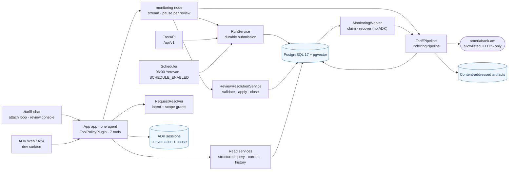
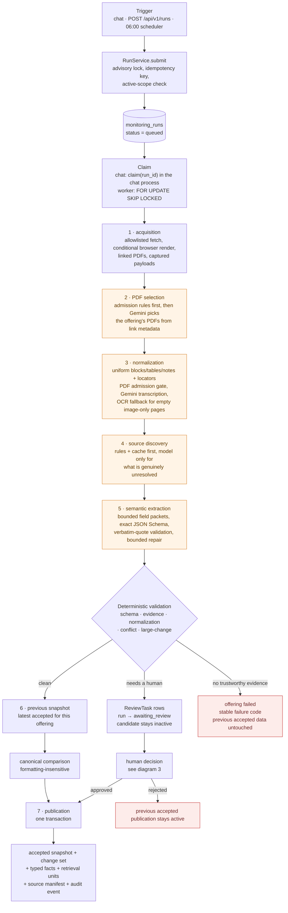
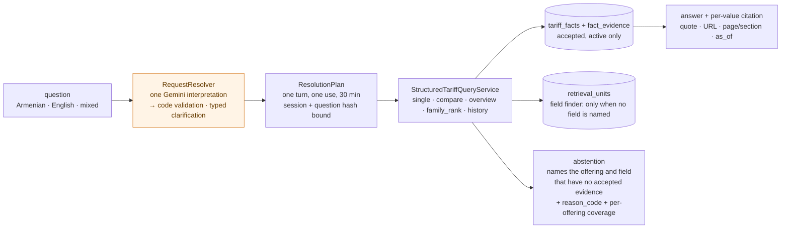

# Architecture diagram

Deliverable 3 of `Project Documents/System Description.md`. Five views of the same
system: components, one monitoring run, the human-review pause, the read path, and
the trust boundary. Prose for each boundary is in [architecture.md](architecture.md);
the reasoning is in
[agent-and-tool-architecture.md](agent-and-tool-architecture.md).

The first four views are Mermaid diagrams and render in GitHub and VS Code; the
fifth is a set of tables, because it enumerates rather than connects. A plain-text
summary of the main flow is at the end for terminal viewing.

---

## 1. Components

Three processes — the terminal CLI, FastAPI, and the worker — share one
composition root (`app/runtime.py`) and one PostgreSQL database. There is one ADK
app with one agent; a chat-initiated run executes in the chat process, inside the
agent's invocation, through the monitoring node. Scheduled and API runs execute in
the worker, which has no ADK at all. Only the pipeline touches the bank. The
worker registers the daily 06:00 job only while `SCHEDULE_ENABLED` is true (the
default); with it off, runs start only from chat or the API.


```mermaid
flowchart LR
    CLI["./tariff-chat<br/>attach loop · review console"]
    WEB["ADK Web / A2A<br/>dev surface"]
    HTTP["FastAPI<br/>/api/v1"]
    SCHED["Scheduler<br/>06:00 Yerevan · SCHEDULE_ENABLED"]

    AGENT["App app · one agent<br/>ToolPolicyPlugin · 7 tools"]
    NODE["monitoring node<br/>stream · pause per review"]
    RESOLVER["RequestResolver<br/>intent + scope grants"]
    QUERY["Read services<br/>structured query · current · history"]
    RUNSVC["RunService<br/>durable submission"]
    WORKER["MonitoringWorker<br/>claim · recover (no ADK)"]
    PIPE["TariffPipeline<br/>IndexingPipeline"]
    REVIEW["ReviewResolutionService<br/>validate · apply · close"]

    PG[("PostgreSQL 17 + pgvector")]
    ADKS[("ADK sessions<br/>conversation + pause")]
    FS[("Content-addressed artifacts")]
    BANK(["ameriabank.am<br/>allowlisted HTTPS only"])

    CLI --> AGENT
    WEB --> AGENT
    AGENT --> ADKS
    AGENT --> RESOLVER
    AGENT --> QUERY
    AGENT --> NODE
    NODE --> RUNSVC
    NODE --> PIPE
    NODE --> REVIEW
    HTTP --> RUNSVC
    SCHED --> RUNSVC
    RUNSVC --> PG
    PG --> WORKER
    WORKER --> PIPE
    REVIEW --> PG
    PIPE --> BANK
    PIPE --> FS
    PIPE --> PG
    QUERY --> PG

    classDef storeBox fill:#eef6ff,stroke:#2b6cb0,color:#1a365d
    class PG,ADKS,FS storeBox
```

State ownership is deliberately split between the two stores. PostgreSQL owns
runs, snapshots, changes, reviews, typed facts, chunks, and audit events. The ADK
session owns the conversation, the paused `adk_request_input` call and its answer,
and the per-turn grants. Nothing correlates them: the pause lives in the
conversation that answers it, and the node re-reads the business state every time it
runs.

### Where Gemini is called

Five call sites, all made by an application service, all schema-bound, none
holding a tool:

| Call site | Model setting | What it decides | What validates the response |
|---|---|---|---|
| `AdkRequestInterpreter` | `MODEL_NAME` | every chat turn: intent, family/offerings, standalone question, and the question's shape (operation, fields, rank, currency) | enum-bounded schema; code checks IDs against the catalog and scope rules (V1–V10) and alone issues grants |
| `AdkPdfLinkClassifier` (stage `discovery.pdf_link_selection`) | `SOURCE_DISCOVERY_MODEL_NAME` | from link metadata alone, which admitted PDFs are this offering's own or shared terms, before any transcription | exactly one decision per link ID and no others, one re-ask, enum-bounded labels |
| `GeminiPdfExtractionService` | `PDF_EXTRACTION_MODEL_NAME` | transcribing an admitted PDF into blocks, tables, and notes | every page present exactly once, rectangular tables, strict schema |
| `AdkSourceDiscoveryClassifier` | `SOURCE_DISCOVERY_MODEL_NAME` | whether an unresolved unit belongs to this product | exactly one known source ID per requested item |
| `AdkSemanticExtractor` | `MODEL_NAME` | evidence into typed tariff field values | in-batch evidence IDs, verbatim quotes, Pydantic contracts |

The root chat agent itself is a sixth site: it chooses which tool to call, and
every tool re-checks its own authorization rather than trusting that choice.

Two neighbours are not generation call sites. `TesseractOcrTranscriber` is a local
engine with no model: it reads a rendered page image only when the probe says
`image_only` and Gemini returned nothing, bounded by page, pixel, timeout and a
confidence floor, with OCR-marked provenance. `GeminiEmbeddingProvider`
(`EMBEDDING_MODEL_NAME`) decides nothing — it returns vectors, checked for count,
768 dimensions and finite values — and runs in the worker's sweep and the field
finder, never inside a monitoring run.

The five schema-bound call sites run with thinking disabled, since reasoning tokens
were being billed at the output rate for output whose shape is already fixed.

---

## 2. One monitoring run

This is the flow section 4 of the assignment asks for, as it is actually
implemented. `IndexingPipeline.refresh()` runs the seven numbered stages for one
offering; `TariffPipeline` runs one such sequence per offering in the family and
isolates their failures from each other.


```mermaid
flowchart TD
    TRIG["Trigger<br/>chat · POST /api/v1/runs · 06:00 scheduler"]
    SUBMIT["RunService.submit<br/>advisory lock, idempotency key,<br/>active-scope check"]
    Q[("monitoring_runs<br/>status = queued")]
    CLAIM["Claim<br/>chat: claim(run_id) in the chat process<br/>worker: FOR UPDATE SKIP LOCKED"]

    S1["1 · acquisition<br/>allowlisted fetch, conditional browser render,<br/>linked PDFs, captured payloads"]
    S2["2 · PDF selection<br/>admission rules first, then Gemini picks<br/>the offering's PDFs from link metadata"]
    S3["3 · normalization<br/>uniform blocks/tables/notes + locators<br/>PDF admission gate, Gemini transcription,<br/>OCR fallback for empty image-only pages"]
    S4["4 · source discovery<br/>rules + cache first, model only for<br/>what is genuinely unresolved"]
    S5["5 · semantic extraction<br/>bounded field packets, exact JSON Schema,<br/>verbatim-quote validation, bounded repair"]
    S6["6 · previous snapshot<br/>latest accepted for this offering"]
    S7["7 · publication<br/>one transaction"]
    VAL{"Deterministic validation<br/>schema · evidence · normalization<br/>· conflict · large-change"}

    TRIG --> SUBMIT --> Q --> CLAIM --> S1
    S1 --> S2 --> S3 --> S4 --> S5 --> VAL
    VAL -->|clean| S6
    VAL -->|needs a human| REV["ReviewTask rows<br/>run → awaiting_review<br/>candidate stays inactive"]
    VAL -->|no trustworthy evidence| FAIL["offering failed<br/>stable failure code<br/>previous accepted data untouched"]

    S6 --> DIFF["canonical comparison<br/>formatting-insensitive"]
    DIFF --> S7
    S7 --> OUT["accepted snapshot + change set<br/>+ typed facts + retrieval units<br/>+ source manifest + audit event"]

    REV --> HUMAN["human decision<br/>see diagram 3"]
    HUMAN -->|approved| S7
    HUMAN -->|rejected| KEEP["previous accepted publication stays active"]

    classDef modelStage fill:#fff4e6,stroke:#d9822b,color:#663c00
    classDef bad fill:#fdecea,stroke:#c53030,color:#742a2a
    class S2,S3,S4,S5 modelStage
    class FAIL,KEEP bad
```

Orange stages are the ones that call Gemini. Stages 1, 6, and 7 and every
decision diamond are pure Python. Stage 2 runs only when the page links PDFs.
Nothing is embedded during a run: retrieval units are published without vectors,
and the worker's sweep embeds them later.

Two properties are worth reading off the diagram. First, no path reaches "accepted
snapshot" without passing the validation diamond. Second, both failure exits lead
to the previous accepted data staying exactly where it was — a failed or rejected
run degrades freshness, never correctness.

---

## 3. Human review, inside one conversation

The pause belongs to the conversation that will answer it. The pipeline runs once;
each review is a native pause of the same ADK invocation, and each answer resumes it.

```mermaid
sequenceDiagram
    autonumber
    participant U as User (CLI)
    participant R as ADK Runner<br/>invocation I
    participant M as Gemini
    participant N as monitoring node
    participant DB as PostgreSQL

    U->>R: "yes" (accepting the monitoring offer)
    R->>M: turn
    M-->>R: resolve_request, then run_tariff_monitoring
    R->>N: tool_context.run_node (spend grant checked)
    N->>DB: submit + claim(run_id)
    N->>N: TariffPipeline stages 1-7
    N-->>U: progress as partial events (streamed, not persisted)
    N->>DB: ReviewTask rows, run → awaiting_review
    N-->>R: RequestInput(review 1) and return
    Note over U,R: invocation I pauses — the model is not called
    R-->>U: review panel: candidates, passages, entry format
    U->>R: validated answer (FunctionResponse)
    R->>N: replay the original tool call; node re-runs
    N->>DB: validate against saved evidence, apply decision
    N->>DB: no review pending → one transaction:<br/>accept snapshot, record changes,<br/>activate documents, close run
    N-->>R: MonitoringResult (+ answer from accepted facts)
    R->>M: call → result (same invocation)
    M-->>U: answer the original question
```

The node re-runs from the top on each resume and derives everything from PostgreSQL,
so acquisition and extraction execute exactly once however many reviews there are and
however long the reviewer takes. A run the scheduler or the API started pauses the
same way in the worker and is reviewed from the CLI with "review them"
(`review_pending_candidates`, the same node in review-only mode).
`POST /api/v1/reviews/abort-pending` is the token-protected bulk `reject_all`.

---

## 4. Answering a question

Questions never acquire sources. They read what monitoring already accepted.


```mermaid
flowchart LR
    Q["question<br/>Armenian · English · mixed"]
    R["RequestResolver<br/>one Gemini interpretation<br/>→ code validation · typed clarification"]
    P["ResolutionPlan<br/>one turn, one use, 30 min<br/>session + question hash bound"]
    SVC["StructuredTariffQueryService<br/>single · compare · overview · family_rank · history"]
    F[("tariff_facts + fact_evidence<br/>accepted, active only")]
    U[("retrieval_units<br/>field finder: only when no field is named")]
    ANSWER["answer + per-value citation<br/>quote · URL · page/section · as_of"]
    ABSTAIN["abstention<br/>names the offering and field<br/>that have no accepted evidence<br/>+ reason_code + per-offering coverage"]

    Q --> R --> P --> SVC
    SVC --> F
    SVC --> U
    F --> ANSWER
    SVC --> ABSTAIN

    classDef modelBox fill:#fff4e6,stroke:#d9822b,color:#663c00
    class R modelBox
```

The plan is an authorization, not routing metadata: a plan that is absent,
replayed, expired, cross-session, or widened is rejected before any repository
call. Comparisons and rankings are computed in Python from typed facts — Gemini
never does the arithmetic, and a ranking abstains rather than comparing values that
differ in currency, unit, rate basis, or fee scope. A ranking that does answer says
"ranked N of M" and lists every offering it left out with its reason.

An abstention carries a `reason_code` — `awaiting_review`, `run_failed`,
`never_monitored`, `no_accepted_data`, `not_stated_in_source`, or
`field_not_extracted` — and, when an in-scope offering has no published data, a
`coverage` list with the reason per offering. The agent's next step (offer a
review, offer monitoring, or say the bank's tariff does not state it) follows from
the code, not from a guess.

---

## 5. Trust boundary

The same constraint from every angle. A diagram would only restate three lists, so
here they are as lists.

**What a Gemini call receives**

| Input | Bound |
|---|---|
| The user's request | the text of one turn, nothing accumulated |
| Allowed answers | the exact enum values and catalog candidate IDs for that decision |
| Evidence | a bounded packet of selected passages, each with an immutable evidence ID |
| Output contract | the exact Pydantic-derived JSON Schema of each requested field |
| Document bytes | the original PDF of one admitted document |

**What it never receives**

| Capability | Why it is absent |
|---|---|
| Network, browser, or fetch tool | acquisition is an application service behind a host allowlist |
| Filesystem or shell tool | artifact paths are derived from SHA-256 only, never from model or source strings |
| Database handle, SQL, or repository | every read is a typed service call with the scope already fixed |
| Authority to widen its own scope | read tools take no scope argument; the per-turn grants are issued by `resolve_request` and bound to the invocation |
| Authority to accept anything | acceptance, activation, and publication are deterministic transactions |

**What Python checks on the way back**

| Check | Failure behavior |
|---|---|
| Enum and candidate membership | falls back to typed clarification, never to a guess |
| Evidence IDs known to that batch | the field becomes a review item |
| Citation quotes occurring verbatim in the cited evidence | the field becomes a review item |
| Pydantic domain contracts | one bounded repair, then review |
| URL, page, and section | restored server-side from the retrieved hit, never trusted from output |

Source text that reaches the model is labelled untrusted data in every prompt, and
a model response can only ever become a *proposal*. The deterministic services
decide what is persisted, activated, and published.

---

## Plain-text summary

For terminals without Mermaid rendering:

```text
  ./tariff-chat (one ADK app)        POST /api/v1/runs / 06:00 scheduler
          |                                      |
   monitoring node, in the                RunService -> PostgreSQL queue
   chat invocation: submit,                      |
   claim, stream progress,               worker claim (SKIP LOCKED),
   pause per review, resume              no ADK; reviews wait for the CLI
          |                                      |
          +------------------+-------------------+
                             |
                             v
  +--------------- TariffPipeline, per offering ----------------+
  |                                                             |
  |  1 acquisition       allowlist, render, linked PDFs         |
  |  2 PDF selection     admission rules  [admitted -> Gemini]  |
  |  3 normalization     uniform evidence   [PDF -> Gemini,     |
  |                                          scanned -> OCR]    |
  |  4 source discovery  rules + cache first   [rest -> Gemini] |
  |  5 semantic extract  bounded packets       [-> Gemini]      |
  |        |                                                    |
  |        +---- deterministic validation ----+                 |
  |          |              |                 |                 |
  |        clean      needs human    no trustworthy evidence    |
  |          |              |                 |                 |
  |  6 previous snapshot    |        fail offering,             |
  |          |       ReviewTask +    keep previous accepted     |
  |  7 publication <- approved --+                              |
  |                                                             |
  +-------------------------------------------------------------+
                    |
                    v
      accepted snapshot + changes + typed facts + audit
                    |
                    v
      questions answered from accepted facts, with citations
```
